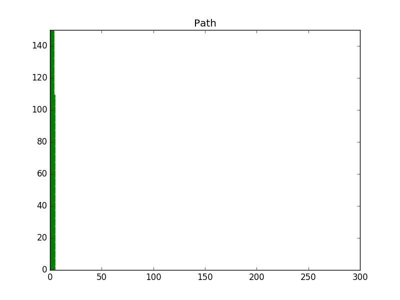

[](https://www.udacity.com/robotics)

# RoboND-A-Visualization
You will visualize the shortest path for the robot to travel through the generated image

### Instruction
The visualization function will plot the state of each grid cell using the matplotlib python library. Edit this function and plot the start position, goal position and path.
``` C++
void visualization(Map map, Planner planner)
{
    //Graph Format
    plt::title("Path");
    plt::xlim(0, map.mapHeight);
    plt::ylim(0, map.mapWidth);

    // Draw every grid of the map:
    for (double x = 0; x < map.mapHeight; x++) {
        cout << "Remaining Rows= " << map.mapHeight - x << endl;
        for (double y = 0; y < map.mapWidth; y++) {
            if (map.map[x][y] == 0) { //Green unkown state
                plt::plot({ x }, { y }, "g.");
            }
            else if (map.map[x][y] > 0) { //Black occupied state
                plt::plot({ x }, { y }, "k.");
            }
            else { //Red free state
                plt::plot({ x }, { y }, "r.");
            }
        }
    }

    // TODO: Plot start and end states in blue colors using o and * respectively
    
    // TODO: Plot the robot path in blue color using a .
    
    //Save the image and close the plot
    plt::save("./Images/Path.png");
    plt::clf();
}
```
Here are some helpful commands you can use to generate plots with the `matplotlib` library:
* *Set Title*: `plt::title("Your Title");`
* *Set Limits*: `plt::xlim(x-axis lower limit, x-axis upper limit );`
* *Plot Data*:`plt::plot({ x-value }, { y-value }, "Color and Shape");`
* *Save Plot*: `plt::save("File name and directory")`;
* *Close Plot*:   `plt::clf()`;

Check out this [link](https://github.com/lava/matplotlib-cpp) for more information on the `matplotlib` C++ library. For information regarding the plot color and shape refer to the LineSpec and LineColor section of the [MATLAB](https://www.mathworks.com/help/matlab/ref/plot.html?requestedDomain=true) documentation. 

### Compiling
```sh
$ cd /home/workspace/
$ git clone https://github.com/udacity/RoboND-A-Visualization
$ cd /RoboND-A-Visualization/
$ rm -rf Images/* #Delete the folder content and not the folder itself!
$ g++ main.cpp -o app -std=c++11 -I/usr/include/python2.7 -lpython2.7
```

### Running
```sh
$ ./app
```

Now, wait for the program to generate the path!

### Generated Path



